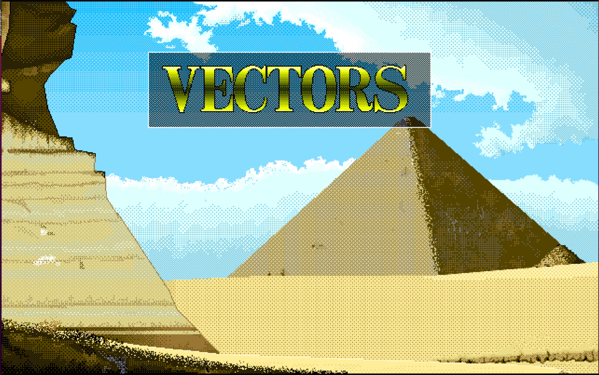
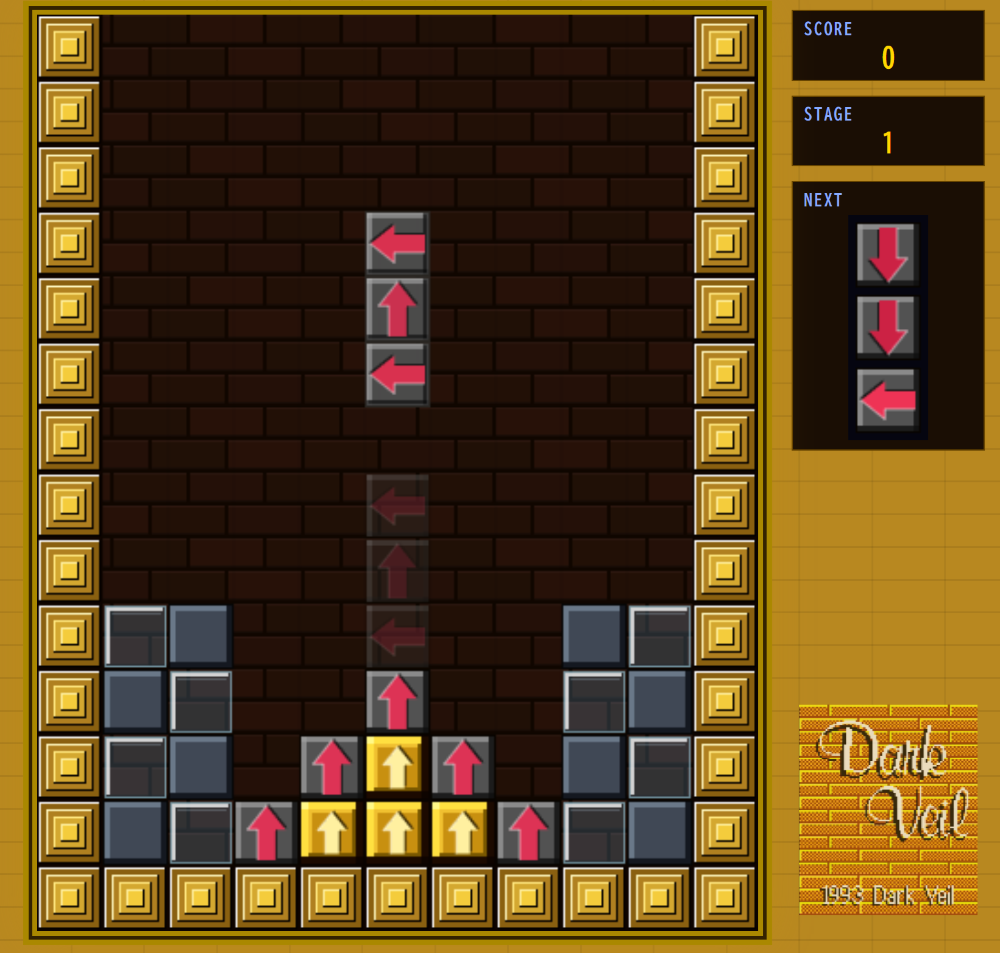

# VECTORS

PC-9801用パズルゲーム「Vectors」（Dark Veil, 1993）のブラウザ移植版です。

**▶ [今すぐプレイ](https://yoshitakaatarashi.github.io/Vectors/)**

---

## ゲーム概要

矢印でループを作り、**金色ブロックを全て消す**とステージクリア。

3個一組の灰色ブロックを落下させ、同色の矢印が向き合って循環する経路（ループ）を形成するとそのブロックが消えます。金色ブロックをループで消し、フィールドから全て排除することがゴールです。

## ブロックの種類

| ブロック | 説明 |
|---------|------|
| 灰色ブロック | 3個一組の落下ピースとして降ってくる |
| 金色ブロック | ループで消すターゲット |
| 固定壁 | ピラミッド型・動かない |
| 灰壁 | 空きスペースへ落下する |
| ガラス壁 | 落下すると砕けて消える |

## 操作方法

| キー | 操作 |
|------|------|
| ← → | 移動 |
| Z / ↑ | 回転 |
| X | 配置変換 |
| ↓ / Space | 落下 |
| P | 一時停止 |
| ESC | タイトルへ戻る |

ゲームパッド対応（Aボタン=決定・回転、Xボタン=変換、Startボタン=ポーズ）。  
キーコンフィグはタイトル画面の **KEY CONFIG** から変更できます。

スマートフォン・タブレットでは画面下部にバーチャルパッドが表示されます。

## 得点システム

- ループ消去: **消去ブロック数² × 10 × 連鎖数** 点
- ステージクリア: **+1000** 点
- 3連鎖以上で画面中央に連鎖数アニメーション表示

## ステージ

- メインステージ: 24面
- プラクティスステージ: 7面

---

## 技術情報

- 純粋な HTML5 + Canvas（外部ライブラリなし）
- 効果音: Web Audio API によるプログラム合成
- ハイスコア・キーコンフィグは localStorage に保存

---

## クレジット

- 原作: **Vectors** / Dark Veil (1993) for PC-9801
- BGM・グラフィック・シナリオ: Dark Veil
- ブラウザ移植コード: Yoshitaka Atarashi

---

## ライセンス

**移植コード** (`index.html`) は [CC BY-NC 4.0](https://creativecommons.org/licenses/by-nc/4.0/) のもとで公開しています。  
非商用目的であれば、著作権表示を維持した上で自由に利用・改変・再配布できます。

**BGM・グラフィック・シナリオ・ゲームデザイン**は原作者 Dark Veil に著作権が帰属します。  
本リポジトリへの収録は個人的なファン移植プロジェクトとしての使用であり、商用目的での二次利用はお控えください。

> © 1993 Dark Veil. Browser port © Yoshitaka Atarashi.
